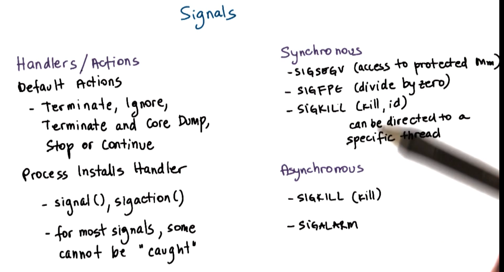

# Thread Design Considerations

Threads can be implemented at the kernel-level, at the user-level or both. In this lecture, we will take a look at the data structures and mechanisms that are necessary to support threads.

## Table of Contents

* [Thread Data Structures](#thread-data-structures)
* [Thread Management Interactions](#thread-management-interactions)
* [Interrupts and Signals](#interrupts-and-signals)

## Kernel vs User Level Threads

Supporting threads at the kernel level means that the OS itself is multithreaded. The OS must maintain a thread abstraction, and be able to perform scheduling and synchronization.

At the user-level, it means there is some library that supports all of these mechanisms 

### Thread Data Structures

In a single-threaded process, the process is described in the PCB. 

In a user-level multi-threaded environment where there is one kernel thread to many user threads.  The user-level library will need to represent threads so that it can track their resource use and make decisions around scheduling and synchronization.

If we want there to be multiple kernel level threads, many-to-many, we will need to split up the PCB into a data structure that is useful for tracking the threads in the kernel. 

Kernel-level threads look like virtual CPUs. 

### Thread Data Structures - At Scale

Let's say we have multiple multi-threaded processes in user-land. We will need to start maintaining relationships between all the data structures. Some threads belong to one application, others belong to another. We also need to maintain a mapping between these user-level data structures and the PCBs maintained by the kernel and the Kernel-level thread data structures. 

Lastly, if using threading to achieve parallel execution, there needs to be a mapping between the threads at the kernel level and the CPU on the machine. 

### Hard and Light Process State

When two kernel level threads belong to the same address space, there is information in the PCB that is relevant for the entire process, but there is also information that is specific to a single thread. 

When we are context-switching between these two threads, there is a portion of the PCB we want to preserve (virtual address mappings), and there is a portion that is really specific to the specific thread and it depends on which user-thread is currently executing. 

To manage this separation of concerns, we will split the process state into:
* **hard process state** - Relevant to all user-level threads. ex: virtual address mappings
* **light process state** -  Process state that is only relevant for a subset of user-level threads that are currently associated with a specific kernel-level thread. Ex: signal mask and sys call args. 

### Rationale for Data Structures

When we had a **single PCB**, it was a large contiguous data structure. Each PCB was private. Whenever we needed to context switch, we had to restore the entire data structure back into memory.

Thus there are fundamental limitations in what this data structure can accomplish: scalability, overhead, performance and flexibility. 

In contrast, **multiple smaller data structures** are easier to share, and context switch only saves and restores what needs to change. 

As a result, many OSes today use the multiple data structure approach to organize their execution context.

### Sun OS Threading Model

This is a diagram of the Stein and Shah paper. It illustrates the threading model supported by the OS. The OS is intended for multiprocessor systems with multiple CPUs. The kernel itself is multi-threaded.

At the user level, the processes can be single or multi-threaded. And both many-to-many or single-to-single mapping between the boundaries are supported. 

The **lightweight process data structure** is an abstraction that virtualizes the CPU that the thread/process is executed on. 

Let's look closer at the user-level thread data structures. These are not POSIX threads, but they are similar. 

Thread creation returns a thread ID. This is not a direct pointer to the thread data structure, instead it is an index in a table of pointers, which in turn point to the data structure.

The thread data structure contains a local storage area that includes the variables that are defined in the thread at compile time. This means the compiler can allocate store on a per-thread basis. This improves locality, and make it easier for the thread to find the next thread. 

One problem is that stack growth can be dangerous, because if too much is written to it, it is possible that one thread can overwrite another thread. The solution is to separate the information between threads with a red zone that is not allocated and used as a canary to detect unrestricted stack growth. Any writes to the red zone will cause a fault.

Let's look at the kernel level structures now.

For each process we maintain information about that **process**.
* what are the kernel level threads that execute in the address space.
* What are the user credentials
* What are the signal handlers that are valid for the process. 

Next we have the **lightweight process data structure**. This information is somewhat similar to what is maintained at the user-level, but this is what is visible to the kernel. 
* user-level registers
* system-call args
* resource usage info
* signal mask

The **kernel-level data structure** includes. This information is not swappable, it always needs to exist. This is different from the LWP. 
* kernel-level registers
* stack pointers
* scheduling class
* pointers to associated LWP, process, and CPU structures.

The **CPU data structure**
* The current thread executing
* list of kernel-level threads that ran there
* information about dispatching and interrupt handling

## Thread Management Interactions

The basic problem here is that the user-level thread does nto know what is happening in the kernel, and the kernel does not know what is happening in the user-level library!

**System calls and special signals allow kernel and ULT library** to interact and coordinate. 

### Thread management visibility and design

We just introduced a problem statement, the kernel and the user level library don't have insight into each other's activities. 

At the kernel level, the kernel sees the kernel level threads, the CPUs and the kernel level scheduler. 

At the user-level the library sees the user-level threads, and the available kernel level threads. Depending on the thread association model (one-to-one, one-to-many, many-to-many), the ULT will see how many threads are available.

A ULT can bound a particular KLT to a particular ULT. 

Let's illustrate the visibility problem. One user-level threads has a lock, and a KLT is supporting the execution of this critical section code. If this KLT is preempted, the execution of the critical section cannot continue. The ULT library will not be able to schedule any more threads because the halted ULT has the lock! Only after the KLT is rescheduled will the lock be released. 

The essential problem here is that the kernel does not have any visibility into mutex variables or wait queues. 

Let's dig deeper here. The best way to understand these problems is to actually understand how the ULT is implemented and executed. 

The user-level library is part of the same address space as the process that is running all of the threads. Occasionally the execution jumps to the appropriate program counter into the user level scheduling library. There are multiple reasons for this to happen!

1. A User-level thread explicitly yields.
2. A timer set by the library expires.
3. ULT calls library functions like lock/unlock. 
4. Blocked threads become runnable.

### Issues on Multiple CPUs

Imagine a scenario where there are three user-level threads. There is a priority between the threads, the higher the thread number, the higher the priority. 

Imagine T2 and T1 are both running on different CPUs, and a resource that T3 needs becomes unlocked by T2. It is time to evict T1, but the signaling for this scheduling decision comes from the KLT that belongs to T2. How do we signal the other KLT to preempt it?

### Synchronizaton-related issues

Another interesting case when we have multiple CPU systems is related to synchronization.

Consider the following situation: One ULT running on top of a KLT on one CPU, this thread has a mutex and a number of ULTs are blocked. 

On another CPU, another ULT is scheduled. Let's say this ULT also needs that same mutex. The normal situation would be to put this ULT onto the mutex queue and have it wait for the mutex to be unlocked.

However, on a multi-CPU system if the critical section is small, it actually might be more efficient to keep that other thread spinning on the CPU until the mutex is unlocked. This saves the OS from having to do the overhead of context switching and putting the ULT on the mutex queue. 

This concept is known as **adaptive mutexes**. They only make sense on multi-cpu systems. 

Once a thread is no longer needed, it should be destroyed and its data should be freed. The allocation of threads takes some time and energy so sometimes, the data structures should be recycled. 

## Interrupts and Signals

**Interrupts** are events generated externally to a CPU by components other than the CPU. They indicate that an event has occurred, they can be I/O devices, timers, or other CPUs. They appear asynchronously, they are not in a direct response to an action on the CPU. They are dependent on the physical platform. 

**Signals** on the other hand are **generated by the CPU and software running on it**. Which signals depend on the OS. These can appear both synchronously and asynchronously.

Both interrupts and signals have a **unique ID**. 

Both of them can be masked, which means they are **disabled and suspended**. **Interrupt masks are per-CPU, and signal masks are per-process**.

### Interrupt Handling

When a device like a disk needs to send a notification to the CPU, it sends an interrupt by sending a signal through the interconnect that connects the device to the CPU complex. In the past this was through wires, but not we just send messages through the PCI interconnector. 

The interrupt displaces the thread that was executing, now what?

Based on the interrupt number, a table is referenced which points to the starting address of the handler. 

Which interrupts can occur on a platform depends on the hardware, and how they are handled is specified by the OS.

### Signal Handling

The situation with signals differs because they are not generated by an external entity. 

The OS maintains a signal handling table and a handler for every OS-defined signal. 

**A process can specify how a signal is handled.**

The OS specifies default actions for handling signals, for most signals however, a process can install its own custom handling routine. `signal()` or `sigaction()`. Some signals cannot be caught though.

### Why disable interrupts or signals?

Interrupts and Signals are executed in the context of the thread that was interrupted. This means that they are handled on the thread stack and can cause certain issues, which leads us to the answer as to why we should disable some interrupts or signals. 

Imagine we have a thread that has a lock on a mutex and it receives an interrupt/signal. The handler of needs the lock on the mutex, but since the thread has been preempted, we will enter a deadlock situation.

The solution to this problem is to disable the interrupt until after the lock is freed. The interrupt/signal does not go away, it just remains pending. As soon as the mask is reset to enable the interrupt/signal, the interrupt will be executed.

A signal/interrupt is typically handled only-once. Thus is it not sufficient to call a signal/handler more than once to have it run more than once. 

Interrupt masks are maintained per CPU. Thus if a mask disables an interrupt, hardware support for routing interrupts will just not deliver that interrupt.

A signal mask is maintained per execution context. If a signal mask suggests that a signal handler is disabled. It wil not interrupt the corresponding thread.

### Interrupts on Multicore Systems

We can designate only a single core in a multi-core system to handle certain interrupts. That means that we can avoid overheads related to interrupt handling, the net effect will be improved performance.

### Types of Signals

There are two types of signals 
* **One-shot signals** - Will be handled at least once. The handling routing must be re-enabled every time. The default action will take place after a call to a custom handler for a one-shot system.
* **Real-time signals** - Will be handled n times, if it is raised n times. They have a queuing behavior. 

### Handling Interrupts as Threads

One way to handle deadlock situations with threads is to dynamically generate a thread for an interrupt. That way the thread can be tucked into a waiting position by the scheduler and execute once the lock that it is blocked on is freed. The only problem with this is that it is expensive. 

The part of the routine that actually responds to the interrupt is referred to as the **top-half**, it is fast and non-blocking. The **bottom-half** performs the slower, asynchronous work. 

### Performance of Threads as Interrupts

### Threads and Signal Handling

Both the user level and kernel level have signal masks. Coordination is needed between the two.

One way to deal with this is to use the UL library to direct which thread should respond to a signal. The function that does this is called the **library handling routine**. The library handling routine invokes the library scheduler to direct the signal to the correct thread. 

Another strategy is to use a **directed signal**. In this case, the user-level library redirects the signal to a thread that can handle it. 

Let's consider the final case where every currently executing user-level thread has masked the signal (disable). The kernel level masks are still 1, which means they still think the process can handle the signal. 

1. The KLT sends the signal and disrupts the thread.
2. The library handling routine sees that no threads support that signal.
3. The library makes a system call to request that the signal mask of the kernel be changed. This will only change the mask of the specific CPU that sent the signal.
4. The library will make this same system call until all kernel level signal masks are changed. 

### Tasks in Linux

Current threading support in Linux has a lot of lessons learned. The main execution abstraction is called a **task**. A task is the execution context of a kernel-level thread.

A single-threaded process will have one task, and a multi-threaded process will have many tasks.

Each task is identified by a task identifier `pid`. For a single-threaded task, the `pid` for the thread and the process will be the same. 

For a multi-threaded task, each one will have its own `pid`. The process as a whole will be identified by the very first task. This id is also stored in the `tgid` field. 

A task structure also maintains a list of tasks in `tasks`.

Linux does not have a monolithic process control block, instead it is represented by a collection of references to data structures: memory management `mm`, file management `files`.

To create a new task, Linux uses `clone()`. The flags parameter is a bit map that specifies which portion of the state of a task will be shared between the parent and the child tasks. 

`fork()` is internally implemented in linux using `clone()` with all of the flags cleared. 

