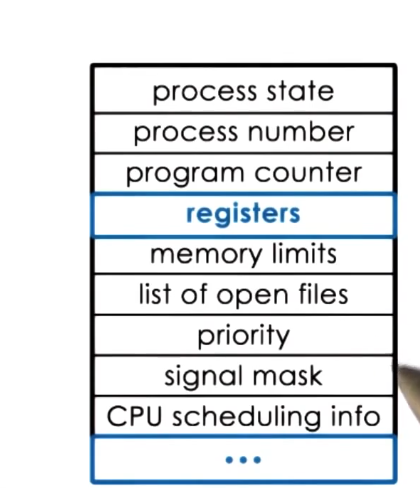
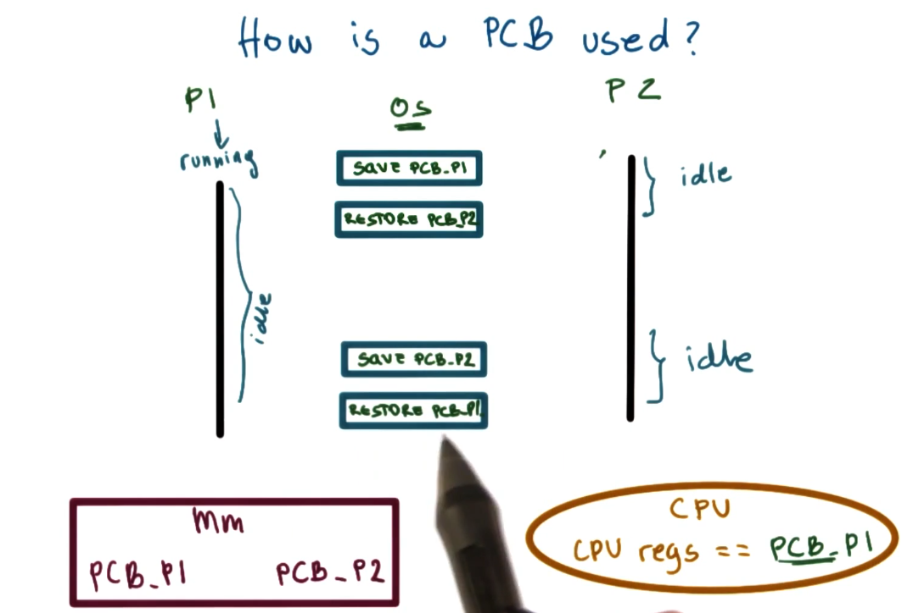

# Processes and Process Management

## Table of Contents

## Introduction

One of the key abstractions of an OS is a process. In this lecture we are going to learn:
* What is a process?
* How are processes represented by the OS
* How are multiple concurrent processes managed by an OS

A process is an instance of an executing program. 

To continue with the toy shop metaphor, a process is like an order of toys. 🧸 

## What is a process?

The OS manages hardware on behalf of applications. An application is a program on disk, flash memory, or in the cloud. 

This program is a static entity. Once an application is launched, it is loaded into memory and starts executing. It becomes an active entity, this active entity is a process. 

## What does a process look like?

A process encapsulates all of the data for a running application. This includes the code, the data, all of the variables that the application needs to allocate. 

Every element of this process needs to be uniquely identified by an address. The OS abstraction used to encapsulate all of the process state is called an address space. 

 

* Text and data are static from when the process first loads.
* The heap is dynamically created during execution.
* The stack grows and shrinks, it is dynamic and works like a LIFO queue. 

The potential range of addresses from V0 to Vmax represent the maximum size of the process address space. These addresses are called virtual addresses. They are called virtual because they don't have to correspond to a physical address in memory.

Instead the memory management hardware and the OS maintain a mapping between virtual addresses and physical addresses. This allows us to decouple the layout of the data in the virtual address space from how that data is laid out in physical memory. 

Page tables are the mapping of virtual to physical addresses. 

## Address Space and Memory Management

Not all processes involve the entire address space. Also, we might not have enough physical memory to hold the entire state of a process. What do we do?!

To deal with this the OS dynamically decides which portion of which address space will be present in physical memory. 

Some address space that isn't needed is kept on disk, and when it is needed it is brought in. The OS must know where all of this data lives. 

## Process Execution State

For an OS to manage processes, it must have some kind of idea of what they are doing. If the OS stops a process, it must know what it was doing so that it can restart it at the exact same point. 

At any given point of time, the CPU needs to know where in the instruction sequence of a binary the process currently is. This is managed by the program counter. The program counter is maintained by the CPU in a register. 

Another piece of state that defines what a process is doing is the process stack. The top of the stack is defined by the stack pointer. 

To maintain all of this useful information for all executing processes, the operating system maintains a process control block (PCB).

## What is a Process Control Block (PCB)?

A process control block is a data structure that the OS maintains for every process it manages. 

* The PCB is created when the process is initially created. It is also initialized at that time.
* Certain fields are updated when the process state changes. 
* Other fields change too frequently (program counter for example)- whenever the process is swapped for another one, the OS saves all of the register information into the PCB.

## How is a PCB used?

When switching between executing processes, the OS uses the PCB to save and then restore the process state in the CPU.

Each time the swapping between the processes is performed is called a context switch. More formally, it is the mechanism used by the operating system to switch the execution from the context of one process, to the context of another process.

Context switches can be expensive! 
1. First there are direct costs which are the number of cycles for load and store instructions.
2. The second is cache misses (cold cache). When a context switch happens, it is likely that none of its data will be loaded into the cache hierarchy and that it will need to be loaded. 

## Process Life Cycle: States

During the context switch discussion, we suggested that processes could be running or idling. 

When a process is running it can be interrupted and context-switched to idle. 

When a process is idle it is ready to execute, except that it is not the current executing process. The scheduler will schedule it for execution.

1. New - When a process is created, the OS will perform admission control, and if the OS determines that it can do so, it will allocate a PCB and some initial resources.
2. Ready - waits in ready state until scheduler is ready to move it into a running state for execution.
3. Running - execution of the process
4. Waiting - When a longer operation needs to happen for the process to finish executing, it is moved into a waiting state. When the event occurs, the process becomes ready again.
5. Termination - When all the operations are finished or when it reaches an error, it will exit.

## Process Life Cycle: Creation

In operating systems a process can create child processes. This means that all processes will come from a single root. 

The creating process is the parent process, the created process is the child process. Some of these processes will have special privileges, these are called root processes.

Once the initial boot is done and the OS is loaded onto the machine it will create some initial processes. When a user logs onto a system, a user shell process is started. 

The final relationship looks like the tree above.

Most operating systems support two basic mechanisms for the creation of a process:
1. fork - copies the parent PCB into the new child PCB. At this point the child continues execution after fork. Both of the processes start their execution at the same point because the PCB is the same (and so is the program counter). 
2. exec - It will take a PCB but it will not match the parent PCB, it will replace the child image with a new program and start from the first instruction.

On UNIX-based OSes, the init process is the parent of all processes. On Android, it is the zygote process. 

## Role of the CPU Scheduler

There will be multiple processes waiting in the ready queue, how do we pick the right process to start executing on the CPU?

The CPU scheduler (OS Component) determines which one of the currently ready processes will be dispatched to the CPU to start running and how long it should run for. 

1. OS must preempt/interrupt the executing process and save the current context. 
2. Then it must run the scheduling algorithm to choose the next process (schedule).
3. Lastly it must dispatch the process and switch to its context.  

The OS should minimize the amount of time it takes to run the above tasks. This means the designs of the actions and data structures that support them must be efficient!

## How long should a process run for?

Also, how frequently should we run the scheduler? If we run the scheduler very often, there will be less time to run the executing process.

If the processing time and the scheduling time are equal, only 50% of the CPU time is spent on useful work. 

The timeslice is the time allocated to a process on the cpu. Deciding appropriate time slices is one rule of a good scheduler. 

## What about I/O? 

How does I/O affect scheduling? There is basically a loop. When an executing process runs into an I/O instruction, the I/O request is executed and then it is moved to the I/O queue, where it waits. Once the I/O finishes, it is moved back to the ready queue. 

Here is an image that demonstrates how a process makes its way to the ready queue. 

The scheduler has no control over how I/O operations are managed.

## Inter Process Communication (IPC)

An operating system provides mechanisms for processes to interact despite the fact that it goes to great pains to isolate processes.

IPC helps to transfer data between two address spaces while maintain protection and isolation between the processes.

Message passing is one means by which the OS provides a communication channel like a shared buffer. The processes interact with the buffer by writing and receiving to the channel. 

The benefits of this approach is that the OS manages the channel, the downsides is that there is overhead because of copying.

In shared memory IPC, the OS establishes a shared channel and maps it to each process address space. Processes directly read and write from memory. Because the OS isn't involved, there is no defined API from the OS. 

The individual data exchange between processes is cheap in shared memory exchange because the data doesn't need to be copied into and out of the kernel. However, the actual operation of mapping memory between two processes is expensive. It only makes sense to do shared memory communication if the setup cost can be amortized across a large number of messages.
