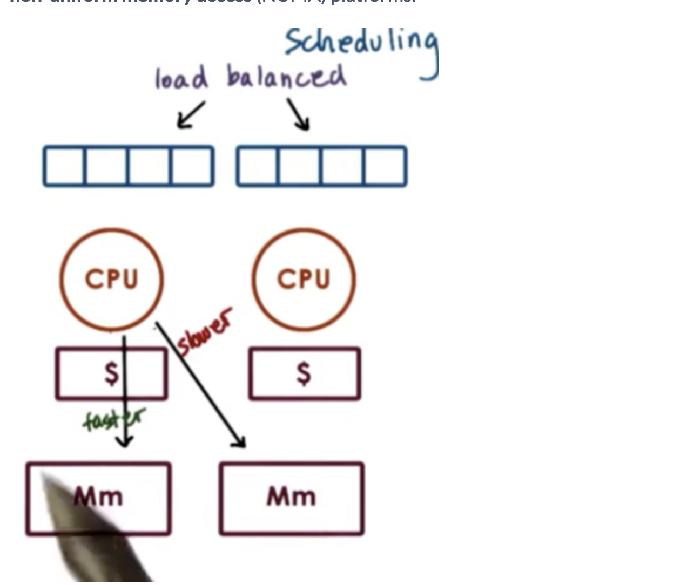

# Scheduling

In the subsequent lectures we will look at how the Operating System manages resources. First we will look at how the OS manages CPUs, and how it decides how processes and threads will execute on the CPU. We will review basic scheduling mechanisms, and data structures. 

We will also look at Linux schedulers and scheduling on multi-CPU platforms.

## A Visual Metaphor

Running with our toy shop metaphor, an OS scheduler is like a toy shop manager responding to work loads. 

## Scheduling Overview

The **CPU scheduler decides how and when processes access shared CPUs**. In this lesson we will use **task** to interchangeably mean processes or threads.

The scheduler concerns itself with **both user-level tasks and kernel-level tasks**.

The responsibility of the scheduler is to **pick a task from the ready queue and dispatch it to the CPU**. 

**Whenever the CPU becomes idle, we need to run the scheduler**. The goal is to pick another task to run as quickly as possible so that the CPU doesn't sit idle for very long. We also need to run the scheduler when a new task becomes ready. **A common way schedulers share the CPU is to set a timer (timeslice)**. When a timeslice expires, the scheduler must run.

Which task should be selected? The answer **depends on the scheduling policy/algorithm**.

How is the scheduling policy accomplished? The details depend on the **runqueue data structure**.  The design of the scheduling algorithm is coupled with the design of the runqueue. 

### Run-to-Completion Scheduling

Run-to-completion scheduling assumes that as soon as a task is assigned to a CPU, it runs until it completes. 

For the purpose of the discussion, it's necessary to make some assumptions. First we can assume that we have a group of tasks that need to be scheduled. Second, we can assume the we know the execution times of the tasks. Third, we can assume that there is no preemption in the system. Fourth, there is a single CPU.

Because we will be comparing scheduling algorithms, we need some metrics to compare them. 

* throughput
* average job completion time
* average job wait time
* cpu utilization

The first algorithm we will talk about is **First-Come First-Server (FCFS)**. In this algorithm tasks are scheduled in the **order that they arrive**. 

Clearly a good way to organize the runqueue, would be a **queue**, so that tasks can be picked up in a FIFO manner.  All the scheduler would need to know is the head of the queue and how to dequeue tasks.

To make a decision, all the algorithm will need to do is pop from the queue. 

This design is simple, but the wait time is really long if a long running job is scheduled in the middle of the queue.

A variation on this algorithm is **Shortest Job First (SJF)**, which schedules tasks in order of their execution time. 

We could organize the data structure as a queue, but we will need to iterate through it to find the shortest run-time each time to find the next job O(n). **One thing we can do is maintain the queue as an ordered queue**. This makes the insertion more complex, but the selection of a task easier.  Or we can use a tree.

### Preemptive Scheduling: SJF + Preempt

So far we've assumed that a task on our CPU cannot be preempted. Let's relax that requirement. 

Let's look at some tasks that don't all arrive at the same time. Using SJF, when shorter tasks arrive, the running process is preempted and the shorter jobs are scheduled. 

One of the details we've glossed over in these simple examples is that **the scheduler will not actually know the execution time of a task**. 

The Scheduler uses heuristics to guess what the execution time will be. Usually the scheduler uses an average of the past execution (windowed average) times to estimate how long it will take. The variability of these execution times has to do with what's in cache, how the network is working, etc. 

### Preemptive Scheduling: Priority

Another criteria that could drive preemption is **priority**. This is a pretty common scenario, OS kernel level tasks that manage critical system components typically have higher priority than user-level threads.

The scheduler needs to know how to run the highest priority task next. 

**This algorithm can be achieved using multiple runqueue structures, a different one for each priority level**. The scheduler will then select a ready task from the highest priority queue possible. 

One danger with priority scheduling is **starvation**, where a low priority task never gets run because higher priority tasks keep getting scheduled.

A mechanism to prevent starvation is **priority aging**, the priority is a function of the task and the time spent on the queue, so the longer it is on the queue, the higher priority it becomes. 

### Priority Inversion

**Priority inversion** is the phenomenon where high priority threads end up running last because they need to acquire locks held by preempted lower priority threads. 

One solution to this problem is to **temporarily boost the priority of the mutex owner** during execution. In the example above, this would mean boosting T3 to P1 priority and have it execute quickly so that it can unlock the mutex. 

### Round Robin Scheduling

A popular scheduling algorithm is **round robin scheduling**. In round robin, the first task from queue is picked up (like FCFS). The task may be preempted (unlike FCFS).

Round Robin can also include priorities. When a higher task arrives, the lower priority task is preempted. Otherwise the task is served liked FCFS. 

Another modification is **round robin with interleaving**. In this strategy, the scheduler uses timers and timeslices to cycle between the different tasks.

### Time Sharing and Timeslices

A **timeslice** is the maximum amount of uninterrupted time given to a task. It is also referred to as a quantum. A timeslice is a maximum amount of time, so a task may run with a shorter duration for instance if it needs to do I/O or is blocked on synchronization. In this case, it will be placed on a queue. 

**Using timeslices allow tasks to timeshare the CPU**. CPU-bound tasks are preempted after timeslice. For I/O bound tasks, this is not super critical, as these tasks will often be placed on wait queues. However, for CPU bound tasks, timeslices are the only way the we can achieve timesharing.

You can see that time slicing allows us to achieve fairly good metrics without having to use a shortest job first algorithm (which has to know execution times). **The benefit of this method is that shorter tasks finish sooner, it is more responsive, and lengthy I/O operations are initiated sooner.**

**The downside** of this strategy is all of the interruptions, this creates **overhead from the context switching**. 

The timeslice should always be bigger than the time to context switch to minimize these overheads. 

To answer **how long a timeslice should be depends on whether we are mainly servicing I/O-bound operations or CPU-bound operations**. 

### CPU Bound Timeslice length

With a smaller timeslice value, we have to pay the time cost of context switching more frequently. This will degrade our throughput and our average completion time. That being said, smaller timeslices mean that tasks are started sooner, so our average wait time is better when we have smaller timeslices.

For **CPU bound tasks, larger time slices are better**. We don't really care about their responsiveness, the user really cares about when they complete and overall when all the tasks finish. 

### IO Bound Timeslice length

For IO bound tasks, in the scenario above, the two tasks are equivalent because of IO blocking. 

For a scenario with only one IO-bound task, we can see that a **smaller timeslice results in better performance**. It allows us to keep the CPU and the I/O devices busy.

### Runqueue Data Structure

The runqueue data structure is **only logically a queue**. It can be implemented as multiple queues or even a tree. What's important is that the **data structure is designed so that the scheduler can easily determine which task should be scheduled next**.

For example, if we want I/O and CPU bound tasks to have different timeslice values, we can either place I/O and CPU bound tasks in the same runqueue and have the scheduler check the type, or we can place them in separate runqueues.

One common data structure is a multi-queue structure that maintains multiple distinct queues, each differentiated by their timeslice value. I/O intensive tasks will be associated with the queue with the smallest timeslice values, while CPU intensive tasks will be associated with the largest timeslice values. 

This is a good solution because it provides timeslicing benefits for I/O tasks and avoids overhead of timeslicing in CPU bound tasks. 

A good question to ask is **how do you know if a task is CPU or I/O intensive**?

Well, one strategy is to use historic metrics, but unfortunately this doesn't help us with new tasks or tasks that have dynamic behaviors. 

One strategy for dealing with these cases is to **move tasks between queues**. 

When a new task enters the system, it is placed in the queue with the smallest timeslice. If the task yields before the timeslice has expired, then a good choice was made. If the task had to be preempted, this implies that the task was more CPU intensive than we though, and we push it down to a queue with a longer timeslice. This pattern repeats until it is sent to the bottom of the queue. 

If a task in a lower queue frequently releases the CPU due to I/O waits, the scheduler can boost the priority of the task and place it in a queue with a a smaller timeslice. 

This responsive data structure is called a **multi-level feedback queue**. 

This is **not just a group of priority queues**. There are different scheduling policies associated with each level. Importantly, it **provides feedback on a task and helps the scheduler understand over time which queue a task belongs to** given the makeup of tasks in the system.

## Linux 0(1) Scheduler

This scheduler gets its name from the fact that it can **add/select a task in constant time**, regardless of the number of tasks in the system. It is a preemptive, priority-based scheduler with 140 priority levels. The priority levels are broken into two classes: Priorities from 0-99 are real-time tasks, 100-139 are for timesharing tasks. 

User processes have priorities in the timesharing class, with the default priority in the middle at 120. **Priority levels can be adjusted with "nice values"** which span from -20 to 19. There is a system call to adjust the priority of a user process.

The 0(1) scheduler **borrows from the MLFQ scheduler in that each priority level is associated with a different timeslice value**. It also us**es feedback to understand how to prioritize** tasks in the future. 

The scheduler assigns the smallest timeslice values to the low-priority CPU bound tasks, and the largest timeslice values to the more interactive tasks. (non-intuitive, read onwards my friend)

The feedback for the task depends on how long the task spent sleeping (time spent waiting) during its timeslice. If a task spends more time sleeping, this means it is more interactive and its priority is boosted (subtract 5). If a task spends less time sleeping, this means it is more computationally intensive and its priority is lowered (add 5).

The **runqueue in the 0(1) scheduler is implemented as two arrays of tasks**. Each array elements points to the first runnable task at that priority level. 

The two arrays are **active** and **expired**. 

The **active list is the primary one the scheduler uses to select the next task to run**. It takes constant time to add a task, as it takes constant time to index into the array and then follow the pointer to the end of the task list to enqueue the task. It takes constant time to select a task because the scheduler relies on certain instructions that return the first set bit in a sequence of bits. If the sequence corresponds to the priority levels and a set bit means there are tasks at that level, then it will take a constant amount of time to run those instructions to detect what is the priority level that has certain tasks on it. Once that position is known, it takes a constant amount of time to index into the array and select the first task. (yeesh)

If a task yields to the CPU to wait on an event or is preempted due to a higher priority task becoming runnable, the time it has spent on the CPU is compared to the timeslice. If it is less than the timeslice, the task is placed back on the active queue for that priority level. 

Only after the entire timeslice has been exhausted will the task move to the expired array. The expired array contains the inactive tasks. This means that the scheduler will not schedule tasks from this array while there are still tasks on the active array. Once there are no more tasks on the active array, the empty and the active array will be swapped.

This helps to explain why the lowest priority tasks have the smallest timeslices. Remember, we had originally thought to give the lowest priority, CPU intensive tasks the largest timeslices. In this case, however, giving the lowest priority tasks the smallest timeslices ensures that low priority tasks (which only run after higher priority tasks expire), do not block the higher priority tasks for too long. The lower priority tasks get their small window to accomplish their work and then yield back to the more important tasks. 

The 0(1) scheduler was introduced in Linux 2.5. Despite its constant time add/select functionality, though this scheduler was not performant enough to keep up the realtime needs of new applications. For this reason it was replaces by the **completely fair scheduler (CFS)** in Linux 2.6.23, which is now the default scheduler. 

## Linux CFS Schedulers

One problem with the 0(1) scheduler is that once a task enters the expired queue, it will not get a chance to run again until all other tasks in the active queue have executed for their timeslices. This is a problem for interactive tasks, introducing jitter into interactions that should appear seamless.

In addition, the scheduler doesn't make any **fairness** guarantees, which is the concept that in a given interval of time, **a task should be able to run for an amount of time that is relative to its priority**. 

CFS is now the default scheduler for non-realtime tasks in Linux.

**CFS uses a red-black tree as the runqueue structure**. Red-black trees are **self-balancing trees**, which **ensure that all of the paths from the root of the tree to the leaves are approximately the same size**. 

Tasks are ordered in the tree based on the amount of time that they spent running on the CPU, a quantity known as vruntime (virtual runtime). CFS tracks this quantity to the nanosecond.

This runqueue has the property that for a given node, all nodes to the left have lower vruntimes and therefore need to be scheduled sooner, while all nodes to the right have larger vruntimes and therefore can wait longer.

The **CFS algorithm always schedules the node with the least amount of vruntime in the system**, which is typically the leftmost node of the tree. Periodially, CFS will increment the vruntime of the task that is currently executing on the CPU, at which point it will compare the currently running task with the leftmost node. If the currently running task has a larger vruntime, it will preempt the running task in favor of the leftmost node.

For lower priority tasks the vruntime will be updated more frequently, that is the scheduler will often check if it is time to preempt a lower priority task. We can think of time moving more quickly for lower priority tasks. For higher priority tasks the vruntime will be updated less frequently, that is **the scheduler will rarely check if it is time to preempt a higher priority task**. 

In summary, task selection from the runqueue takes constant time. Adding a task to the runqueue takes log time relative to the total number of tasks in the system.

## Scheduling on Multiprocessors

In a **shared memory multiprocessor**, there are multiple CPUs. Each CPU has its own private L1/L2 cache, as well as a last-level cache (LLC) which may or may not be shared amongst the CPUs. Finally, there is system memory (DRAM) which is shared across the CPUs. 

In a **multicore system**, each CPU can have multiple internal cores. Each core has its own private L1/L2 cache, and the CPU as a whole shares an LLC. DRAM is present in this system as well. 

As far as the OS is concerned, it sees all of the CPUs and all of the cores in the CPUs as entities onto which it can schedule tasks. 

Since the performance of processes/threads is highly dependent on the amount of execution state tha tis present in the CPU cache, as opposed to main memory, it makes sense that we would **want to schedule tasks on to CPUs such that we can maximize how "hot" we can keep our CPU caches**. To achieve this, we want to **schedule our tasks back on the same CPU they had been executing on** in the past. This is known as **cache affinity**. 

To achieve cache affinity, we can have a hierarchical scheduling **architecture which maintains a load balancing component that is responsible for dividing the tasks among CPUs**. Each CPU then has its own scheduler with its own runqueue, and is responsible for scheduling tasks on that CPU exclusively.

To load balance across the CPUs, we can look at the length of each of the runqueues to ensure one is not too much longer than the other. In addition, we can detect when a CPU is idle, and rebalance some of the work from the other queues on to the queue associated with the idle CPU. 

In addition to having multiple processors, it is **possible to have multiple memory nodes**. The CPUs and the memory nodes will be connected via some physical interconnect. In most configurations it is common that a memory node will be closer to a socket of multiple processors, which means that access to this memory node from those processors is faster than accessing some remote memory node. We call these platforms **non-uniform memory access (NUMA) platforms**. 

From a scheduling perspective, what makes sense is to keep tasks on the CPU closest to the memory node where the state is, in order to maximize the speed of memory access. We refer to this as NUMA-aware scheduling.

## Hyperthreading

The reason we have to context switch among threads is because the CPU only has one set of registers to describe an execution context. Over time, hardware architects have realized they can hide some of the latency associated with context switching. One strategy is to have **CPUs with multiple sets of registers where each set of registers can describe the context of a separate thread**. 

This is called **hyperthreading**. In hyperthreading, we have multiple hardware-supported execution context. We still have one CPU - so only one of these threads will execute at a given time - but context switching amongst the threads is very fast.

This mechanism is referred to by many names: hardware multithreading, hyperthreading, chip multithreading (CMT), simultaneous multithreading (SMT). Don't be bamboozled.

Modern platforms often support two hardware threads, though some high performance platforms may support up to eight. Modern systems allow for hyperthreading to be enabled/disabled at boot time, as there are tradeoffs to this approach.

If hyperthreading is enabled, each of these hardware contexts appears to the scheduler as an entity upon which it can schedule tasks. If the amount of time a thread is idling is greater than the amount of time to context switch twice, it makes sense to context switch. Since a hardware context switch is on the order of cycles and DRAM access is on the order of hundreds of cycles, hyperthreading can be used to hide memory access latency.

### Scheduling for hyperthreading platforms

To understand what is required from a scheduler in a hyperthreaded platform, we must first make some assumptions.

First, we need to assume that a thread can issue an instruction on every CPU cycle. This means that a CPU bound thread will be able to maximize the instructions per cycle. 

Second, we need to assume that memory access takes four cycles. What this means is that a memory bound thread will experience some idle cycles while it is waiting for memory access to complete.

Third, we can assume that hardware switching is instantaneous. 

Finally, we will assume that we have an SMT platform with two hardware threads.

Let's look at a scenario of co-scheduling two compute-bound threads.

Even though each thread is able to issue a CPU instruction during each cycle, only one thread will be able to issue an instruction a atime since there is only one CPU pipeline. As a result, **these threads will interfere with one another as they compete for CPU pipelines resources**. 

The best case scenario is that a thread idles every other cycle while it yields to the other thread. This degrades the thread performance by a factor of two. In additionm the memory component is completely idle during this computation and nothing is performing any memory access.

Let's look at co-scheduling memory-bound threads.

Similar to the CPU-bound example, we still have idle time where both reads are waiting on memory access to return, which means wasted CPU cycles. 

Finally, let's considered co-scheduling a mixture.

This solution seems best. We can schedule the CPU-bound thread until the memory-bound thread needs to issue a memory request. We context switch over, issue the request, and then context switch back and continue our compute-heavy task.

Scheduling a mix of memory/CPU-intensive threads allows us to avoid or at least limit the contention on the processor pipeline and ensure utilization across both the CPU and the memory components.

## CPU-Bound or Memory-Bound?

How do we know if a thread is CPU-bound or memory-bound? We need to use historic information.

When we looked previously at determining whether a process was more interactive or more CPU intensive, we looked at the amount of time the process spent sleeping. This approach won't work for two reasons. First, the thread is nto really sleeping when it is waiting for memory access, it is waiting on the processor pipeline, not somewhere in the software queue. Second, to keep track of the sleep time we were using software methods, and that is too slow at this level. The context switch takes on the order of cycles, so we need to be able to make our decision very quickly.

We need hardware-level information.

Most modern platforms contain **hardware counters** that get updated as the processor executes and keeps information about various aspects of execution like: L1, L2 cache misses, Instructions per cycle (IPC), and power/energy usage data. 

There are a number of **software interfaces** to these counters such as **oprofile, or Linux perf tool**. 

Many practical scheduling techniques rely on the use of hardware counters to understand something about the resource needs of a thread. The scheduler can use this information to pick a good mix of threads that are available in the runqueue to schedule in the system.

For example, a thread scheduler can look at the number of LLC misses and determine if this number is great enough, then the thread is likely memory-bound.

## Scheduling with Hardware Counters (Fedorova)

Fedorova speculates that a more concrete metric to help determine if a thread is CPU-bound or memory-bound is **cycles-per-instruction (CPI)**. A memory-bound thread will take a lot of cycles to complete an instruction, therefore it has high CPI. A CPU-bound thread will have a CPI or 1 or some low number, as it can complete an instruction every cycle.

Fedorova uses a simulation with 4 cores, with each core having a 4-way SMT. She creates a synthetic workload where her threads have a CPI of 1, 6, 11, and 16. She runs four experiments with each core having a specific composition of threads. 

In the first two experiments, we have a fairly well balanced mix of high and low CPI threads across the cores. We see that in these two cases, the processor pipeline was well-utilized and that our IPC is high.

In the last two experiments, each of the cores were assigned tasks with similar or identical CPI values. We can see that in these two cases, the processor pipeline was much more poorly utilized. Threads either spent a lot of time in contention with one another - in the case of CPU-bound tasks - or spend a lot of time idling in the case of memory-bound tasks. Regardless the IPC dropped.

We can conclude that scheduling tasks with mixed CPI values leads to higher performance utilization.

