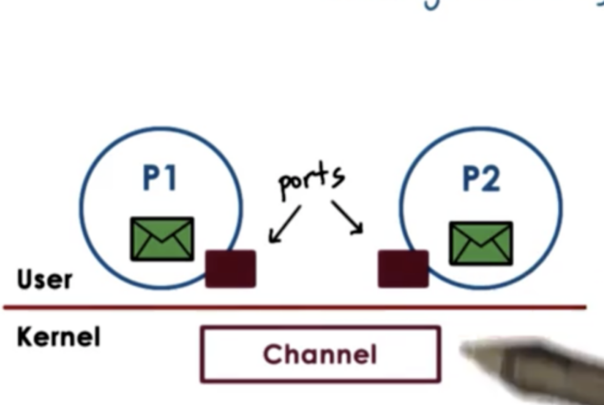
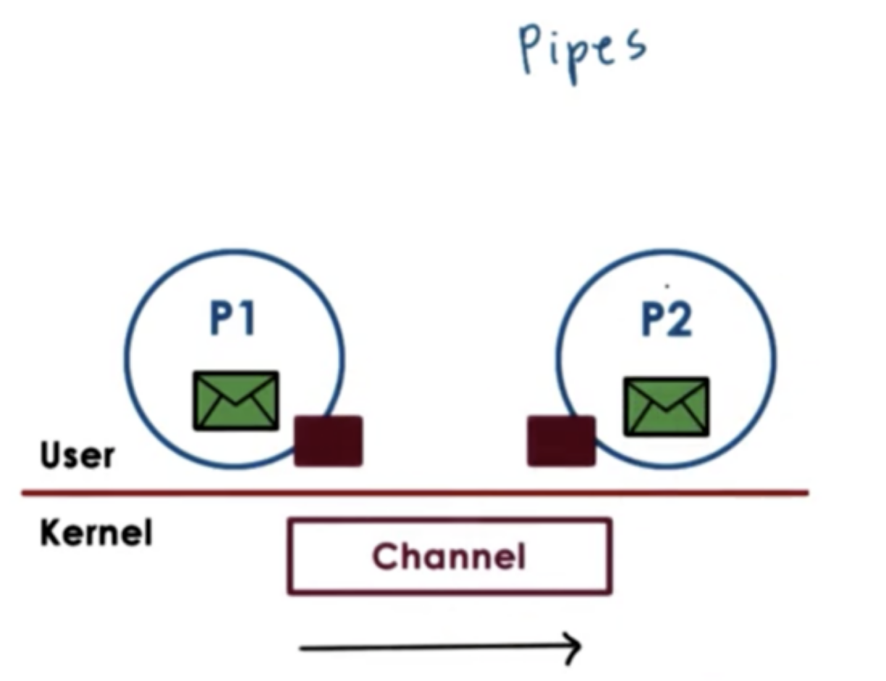
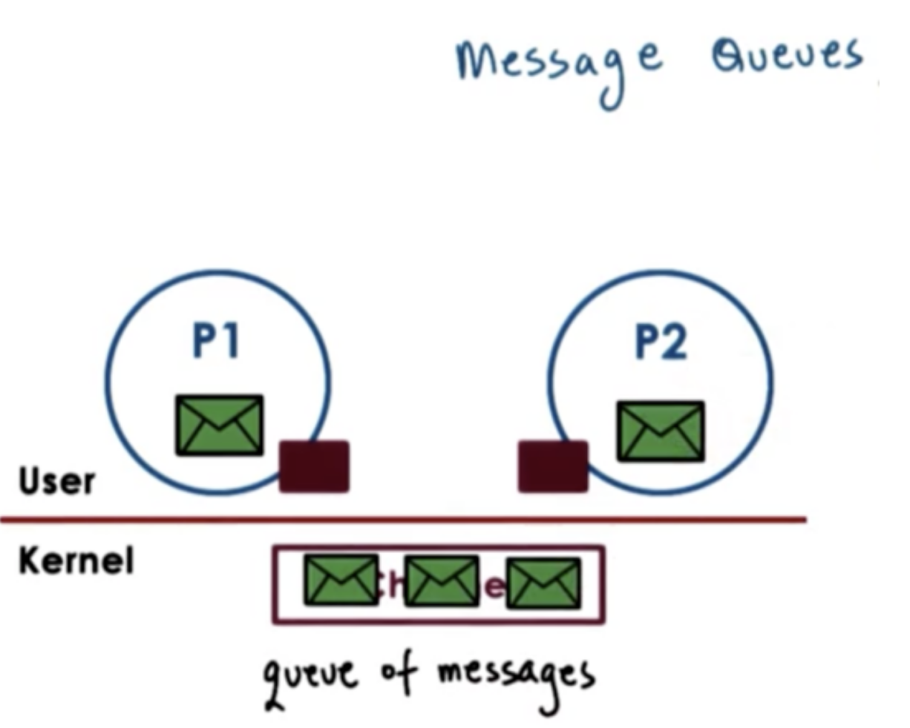
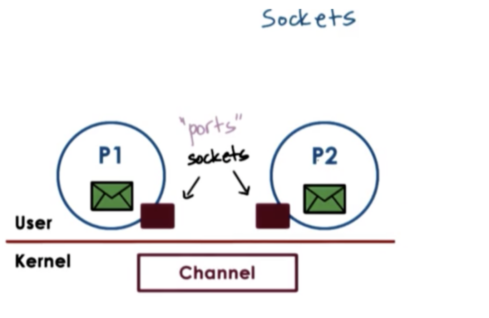
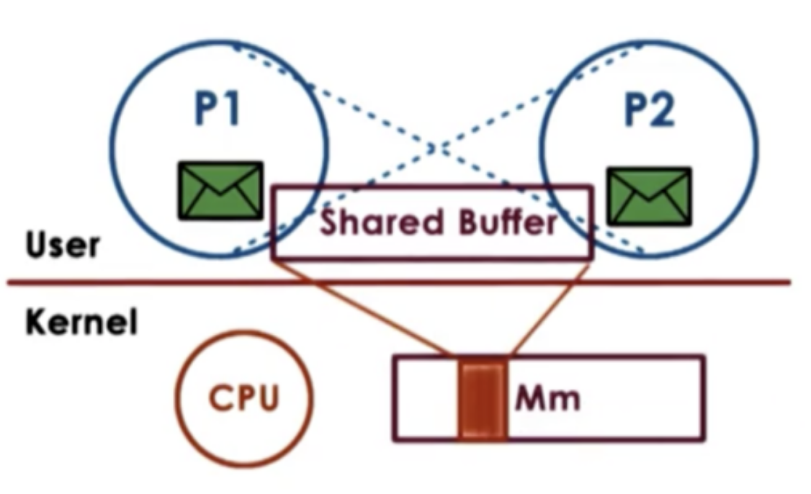
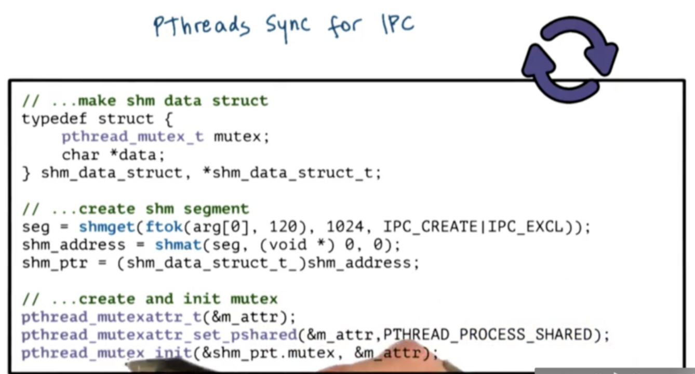
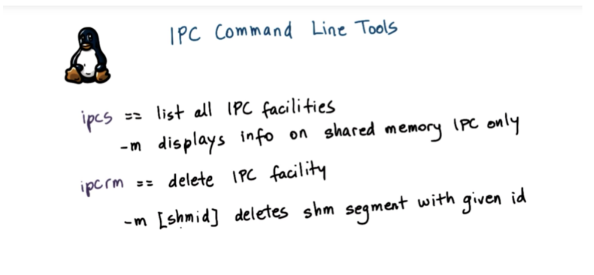

# Inter process Communication (IPC)

## Table of Contents

* [Introduction](#introduction)
* [Message-based IPC](#message-based-ipc)
    * [Pipes](#forms-of-message-passing-pipes)
    * [Message Queues](#forms-of-message-passing-message-queues)
    * [Sockets](#forms-of-message-passing-sockets)
* [Shared Memory IPC](#shared-memory-ipc)
    * [Copy vs Map](#copy-vs-map)
    * [SysV Shared Memory](#sysv-shared-memory-api)
    * [POSIX Shared Memory](#posix-shared-memory-api)
    * [Shared Memory and Sync](#shared-memory-and-sync)
    * [Sync for Other IPC](#sync-for-other-ipc)
* [Thinking about IPC](#how-to-think-about-designing-ipc)

## Introduction

**Inter process communication (IPC)** refers to **a set of mechanisms that the OS must support in order to permit multiple processes to interact with each other**. This includes mechanisms related to **synchronization, coordination and communication**.

IPC mechanisms are broadly categorized as either **message-based** or **memory-based**. 

Message-based IPC mechanisms include **sockets, pipes, and message queues**.

Memory-based IPC mechanisms utilize **shared memory**. This may be in the form of unstructured shared physical memory pages or memory mapped files which can be accessed by multiple processes.

Another mechanism that provides higher level semantics with regards to IPC is **remote procedure calls (RPC)**. RPC is more than just a channel for passing information between processes. This method provides some additional information as to the protocols that will be used, which includes information about data format and the data exchange procedure.

Finally, the need for communication and coordination illustrates the necessity of synchronization primitives.

## Message-based IPC



In message-based IPC, **processes create messages and then send and receive them**. The OS is responsible for creating and maintaining the channel that is used to send these messages.

The OS provides an interface to the processes so that they can send messages via this channel. The processes send/write messages to a port, and then recv/read messages from a port. The channel is responsible for passing the message from one port to the other.

Since the OS is required to establish communication and perform each IPC operation, **every send and receive call requires a system call and a data copy**. When we send, the data must be copied from the process address space into the communication chanel. When we receive, the data must be copied from the communication channel into the process address space.

This means that a request-response interaction between two processes **requires a total of four user/kernel crossings and four data copying operations**. These **overheads** are one of the negatives of message-based IPC.

One of the positives of this approach is the **relative simplicity**. The OS kernel will take care of all the operations regarding channel management and synchronization.

### Forms of Message Passing - Pipes



Pipes are **characterized by two endpoints**, so **only two processes can communicate via a pipe**. There is no notion of a message with pipes, instead **there is a stream of bytes pushed into the pipe** from one process and read from the pipe by the other process.

One popular use of pipes is to connect the output from one process to the input of another.

```bash
cat /some/large/file | grep "search for something specific"
```

### Forms of Message Passing - Message Queues



Message queues understand the notion of messages that they can deliver. **A sending process must submit a properly formatted message to the channel, and then the channel can deliver this message to the receiving process**.

The OS level functionality regarding message queues includes mechanisms for message priority, custom message scheduling and more.

The use of message queues is supported via different APIs in Unix-based systems. Two common APIs are SysV and POSIX.

### Forms of Message Passing - Sockets



With sockets, processes send and receive messages through the socket interface. The socket API supports `send` and `recv` operations that allow processes to send message buffers in and out of the kernel-level communication barrier.

The `socket` call itself **creates a kernel-level socket buffer**. In addition, it will associate any kernel level processing that needs to be associated with the socket along with the actual message movement.

For instance, the socket may be a TCP/IP socket, which means that the entire TCP/IP protocol stack is associated with the socket buffer.

Socket-based communication can happen between processes on two different machines. If the processes are on two different machines, then the communication buffer is really between the process and the network device that will actually send the data.

## Shared Memory IPC



In shared memory IPC, processes **read and write into a shared memory region**. The **operating system is involved in establishing the shared memory channel** between the processes.

**The OS will map certain physical pages in memory into the virtual address space of both processes**. The virtual addresses in each process pointing to a shared physical location do not have to be the same (they are virtual after all). In addition, the shared physical memory section does not need to be contiguous.

The **big benefit of this approach is that once the physical memory is mapped into both address spaces, the operating system is out of the way. System calls are only used for the setup phase**.

Data copies are reduced, but not necessarily avoided. For data to be available to both processes, it needs to explicitly be allocated from the virtual addresses that belong to the shared memory region. If that is not the case, the data within the same address space needs to be copied in and out of the shared memory region.

Since the shared memory area can be concurrently accessed by both processes, this means the **processes must explicitly synchronize their shared memory operations**. In addition, it is **now the developer's responsibility to handle any protocol-related implementations, which adds to the complexity** of the application.

Unix-based systems support two popular shared memory APIs: SysV and POSIX. In addition, shared memory IPC can be established between processes by using a **memory-mapped file**.

### Copy vs Map

The **goal of both message-based and memory-based IPC is to transfer data from the address space of one process to the address space of another process**.

In message-based IPC, this requires that the CPU is involved in copying the data, and CPU cycles are spent every time data is copied to/from ports.

In memory-based IPC, CPU cycles are spent to map physical memory into the address spaces of the processes. The CPU may also be involved in copying the data into the shared address space, but not that here is no user/kernel switching in this case.

The memory-mapping operation is costly, but it is a one-time cost, and can pay off even if IPC is performed once. In particular, when we need to move large amounts of data from one address space to another address space, the time it takes to copy via message-based IPC greatly exceeds the setup cost of memory-mapping.

## SysV Shared Memory API

To create or open a segment we use

```c
shmget(shmid, size, flag)
```
We can specify the size of the segment through the `size` argument, and we can set various flags, like permission flags, with the `flag` argument.

The `shmid` is the key that references the shared memory segment. This is not created by the operating system, but rather has to be passed to it by the application. To generate this key, we can use:

```c
ftok(pathname, proj_id)
```
This function generates a token based on its arguments. If you pass it the same arguments, you will always get the same key. It's basically a **hashing function**. This is how **different processes can agree upon how they will obtain a unique key for the memory segment they wish to share**. 

To attach the shared memory segment into the address space of the process, we can use:

```c
shmat(shmid, addr, flags)
```
The programmer has the option to provide the virtual addresses to which the segment should be mapped, using the `addr` argument. If `NULL` is passed, the OS will choose some suitable addresses.

The returned virtual memory address can be interpreted in various ways, so it is the programmer's responsibility to cast the address to that memory region to the appropriate type.

To detach a segment, we can use

```c
shmdt(shmid)
```

This call invalidates the virtual to physical mappings associated with this shared segment.

Finally, to send commands to the operating system in reference to the shared memory segment we can use:

```c
shmctl(shmid, cmd, buf)
```

if we specify `IPC_RMID` as the `cmd` we can destroy the segment.

## POSIX Shared Memory API

The POSIX shared memory standard doesn't use segments, but rather **uses files**.

They are not "real" files that live in a filesystem that are used elsewhere by the OS. Instead **they are files that live in the *tmpfs* filesystem**. This filesystem is intended to look and feel like a filesystem, so the OS can reuse a lot of the mechanisms is uses for filesystems, but it is really just a bunch of state that is present in physical memory. The **OS simply uses the same representation and the same data structures that it uses for representing a file to represent a bunch of pages in physical memory** that correspond to a shared memory region.

Since shared memory segments are now referenced by a file descriptor, there is no longer a need for the key generation process. A shared memory region can be created/opened with `shm_open`. To attach shared memory, we can use `mmap` and to detach shared memory we can use `mummap`. To destroy a shared memory region, we can call `shm_unlink`.

## Shared Memory and Sync

When data is placed in shared memory, it can be concurrently accessed by all processes that have access to that shared memory region. Therefore, such accesses must be synchronized to avoid race conditions. This is the same situation we encountered in multithreaded environments.

There are a couple of options for handling inter-process synchronization. We can rely on the mechanisms supported by threading libraries that can be used within processes. For example, two pthreads processes can synchronize amongst each other using pthreads mutexes and condition variables. Alternatively, the OS supports certain mechanisms for synchronization that are available for IPC.

### Pthreads Sync for IPC

One of the attributes that are used to specify the properties of the mutex or condition variable when they are created is **whether or not that synchronization variable is private to a process or shared amongst processes**.

The keyword for this is `PTHREAD_PROCESS_SHARED`. If we specify this in the attribute structs that are passed to mutex/condition variable initialization we will ensure that our synchronization variables will be visible across processes.

One very important thing to remember is that these data structures must also live in shared memory!



To create the shared memory segment, we first need to create our segment identifier. We do this with `ftok`, passing `arg[0]` which is the pathname for the program executable as well as some integer parameter. We pass this id into `shmget`, where we specify a segment size of 1kb and also pass in some flags.

Using the segment id, we attach the segment with `shmat`, which returns a shared memory address, which we assign to the variable `shm_address`. This is the virtual address in this process' address space that points to the physically shared memory.

Then we cast the address to the datatype of the struct we defined, `shm_data_struct_t`. This struct has two fields, one is the actual buffer of information, the data, and the other component is the mutex. The mutex controls access to the data.

To actually create the mutex, we first have to create the mutexattr struct. Once we create it, we can set the pshared attribute with PTHREAD_PROCESS_SHARED. Then we initialize the mutex with that data structure, using the pointer to the mutex inside the struct that lives in the shared memory region.

This set of operations will properly allocate and initialize a mutex that is shared amongst processes.

### Sync for Other IPC

In addition, shared memory accesses can be synchronized using OS provided mechanisms for inter process interactions. This is particularly important because the `PTHREAD_PROCESS_SHARED` option for pthreads isnt always necessarily supported by every platform.

We can rely on other means of synchronization in those cases such as message queues and semaphores.

With message queues, we can implement mutual exclusion via send/recv operations. For example, process A can write to the data in shared memory and then send a "ready" message into the queue. Process B can receive the msg, read the data, and send an "ok" message back.

**Semaphores** are an OS support synchronization construct and a binary semaphore can have two states. When a semaphore has a value of 0, the process will be blocked, if it has a value of 1, the process will decrement the semaphore and proceed.

## IPC command line tools



## How to think about designing IPC

Let's consider two multithreaded processes in which the threads need to communicate via shared memory.

First, consider how many segments the processes will need to communicate.

Will you use one large segment? If so, you will have to implement some kind of management of the shared memory. You will need some manager that will be responsible for allocating and freeing memory in this region.

Alternatively, you can have multiple segments, one for each pairwise communication. If you choose this strategy, it is probably a smart idea to pre-allocate a pool of segments ahead of time, so you don't need to incur the cost of creating a segment in the middle of execution. With this strategy, you will also need to manage how these segments are picked up for use by the pairs. A queue of segment ids is probably sufficient.

Second, you will need to think about how large your segments should be.

If the size of the data is known up front (and is static), you can just make all your segments that size. Typically an operating system will have a limit on the maximum segment size, so this strategy only works in very restricted cases.

If you want to support arbitrary messages sizes that are potentially much larger than the segment size, one option is to transfer the data in rounds. The sending process sends the message in chunks, and the receiving process reads in those chunks and saves them somewhere until the entire message is received. In this case, the programmer will need to include some protocol to track the progress of the data movement through the shared memory region.