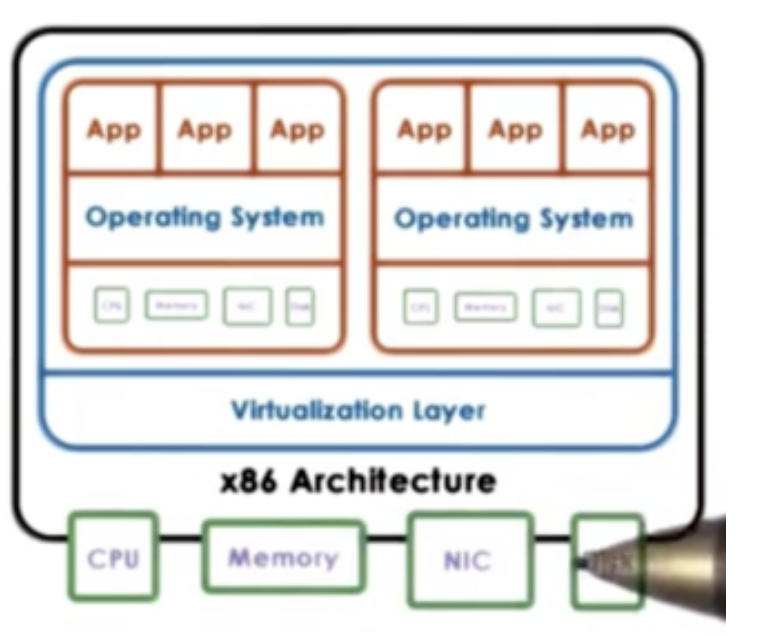
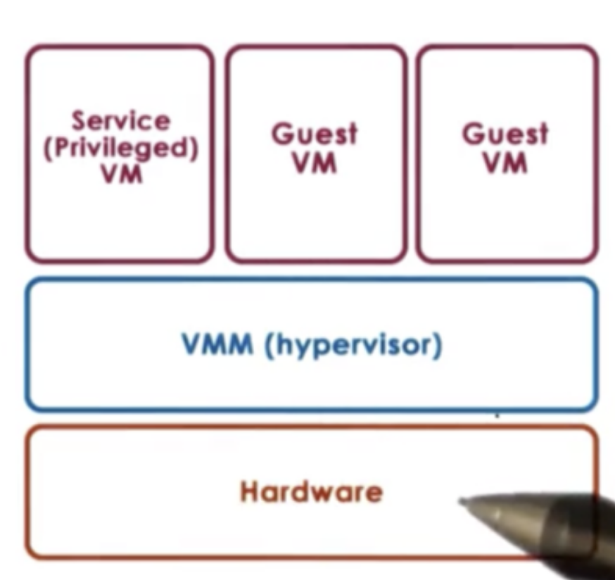
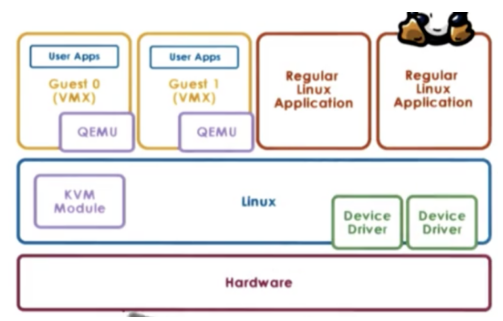
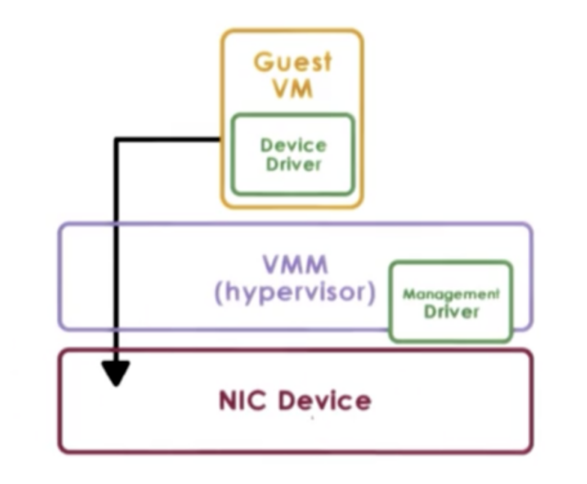
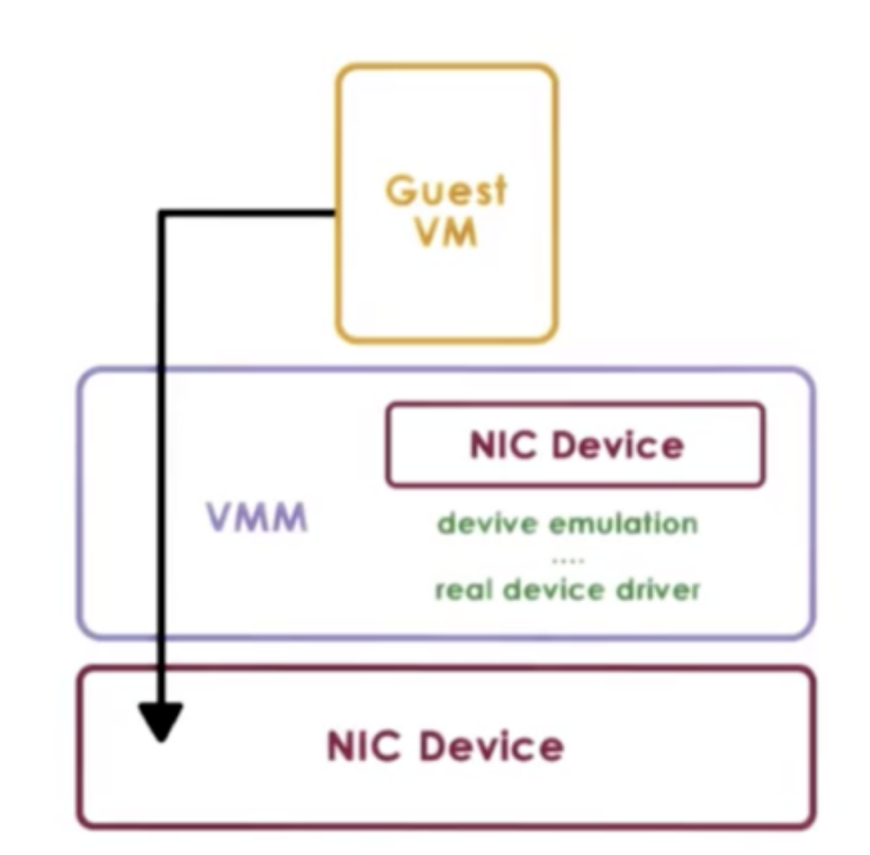
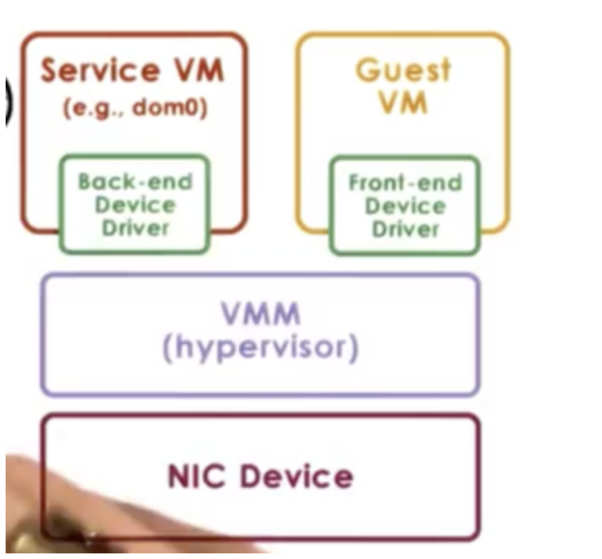
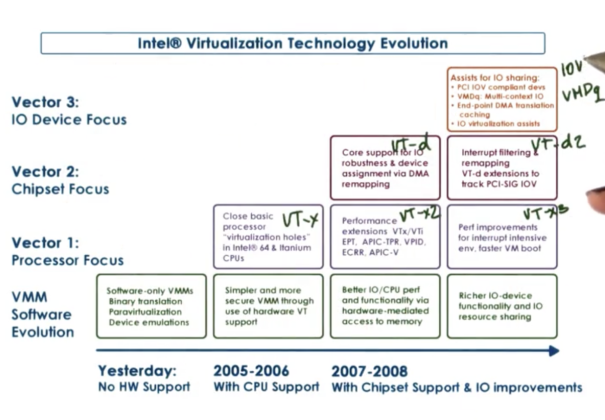

# Virtualization

## Table of Contents

* [Introduction to Virtualization](#what-is-virtualization)
    * [Benefits of Virtualization](#benefits-of-virtualization)
    * [Virtualization Models - Type 1](#virtualization-models-bare-metal)
    * [Virtualization Models - Type 2](#virtualization-models-hosted)
* [Hardware Protection Levels](#hardware-protection-levels)
* [Processor Virtualization](#processor-virtualization)
* [Binary Translation](#binary-translation)
* [Paravirtualization](#paravirtualization)
* [Memory Virtualization - Full](#memory-virtualization-full-virtualization)
* [Memory Virtualization - Paravirtualizaton](#memory-virtualization-paravirtualization)
* [Device Virtualization](#device-virtualization-introduction)
    * [Passthrough Model](#device-virtualization-passthrough)
    * [Hypervisor Direct Model](#device-virtualization-hypervisor-direct)
    * [Split Device Driver Model](#device-virtualization-split-device-driver)
* [Hardware Virtualization](#hardware-virtualization)

## What is Virtualization?

In order to concurrently run diverse workloads on the same physical hardware without requiring that a single OS be used for all of the applications, it was necessary to come up with a model where **multiple OS's can concurrently be deployed on the same hardware**. This is **virtualization**.

With virtualization, each of the **operating systems** that are deployed on the same physical platform **have the illusion that they own the underlying hardware resources**. 

**Each OS, plus its applications and virtual resources** is called a **virtual machine (VM)**. 

Supporting the coexistence of multiple VMs on a single machine **requires underlying functionality in order to deal with the allocation and management of real hardware resources. It is also necessary to guarantee isolation across the VMs**.

This functionality is provided by the **virtualization layer**, also referred to as the **virtual machine monitor or hypervisor**. 

A virtual machine is an **efficient, isolated duplicate** of a real machine.

Virtualization is supported by the VMM, which has three responsibilities:

1. The VMM must provide an environment that is essentially identical to the original machine. The capacity may differ, but the overall setup should be the same. The VMM must provide **fidelity** that the representation of the hardware that is visible from the VM matches the hardware that is available on the physical platform.
2. The programs run on VMs must show at worst only minor decreases in speed. VMs are only given a portion of the resources available to the host machine. **The goal of a VMM is to ensure that the VM performs at the same speed as a native application**. 
3. The VMM is in complete control of system resources. It should control who accesses which resources and when, and it should be **relied upon to provide safety and isolation** among the VMs.

## Benefits of Virtualization

Virtualization enables **consolidation**, the ability to run multiple VMs on a single physical platform. This leads to fewer machines with less space, with fewer admins, with potentially a smaller electric bill!

It allows companies to decrease cost and improve manageability. 

Virtualization also makes **migration** easier. Since the OS and the applications are no longer coupled to a physical system, it is easy to setup, teardown and clone virtual machines.

Virtualization also helps us address **availability** and **reliability**. If we notice that a physical machine is about to go down, we can easily spin up a new VM on a different physical platform.

Because the OS and the applications are nicely encapsulated in a VM, it becomes easier to contain bugs or malicious code to those isolated containers without bringing down other VMs or the physical platform.

Lastly, virtualization is good for OS research and providing support for legacy OSes. 

## Virtualization Models: Bare Metal

In **bare-metal** virtualization (also known as **hypervisor-based** or **type 1 virtualization**), the VMM manages all of the hardware resource and supports execution of the VMs.

One issues with this model concerns devices. According to the model, the hypervisor must manage all possible devices. In other words, device manufacturers have to provide device drivers not just for the different OS's, but also for different hypervisors. 

To eliminate this problem, the hypervisor model typically integrates a special virtual machine, a **service VM**, that runs a **standardized OS with full hardware access** privileges, allowing it to manipulate hardware as if it was native. 

The privileged VM runs all of the device drivers and controls how the devices on the platform are used. This VM will run some other configuration and management tasks to further assist the hypervisor.

This model is adapted by Xen virtualization software and by the ESX hypervisor from VMware.

Regarding Xen, the VMs that run in the virtualized environment are referred to as domains. The privileged domain is referred to as **dom0** and the guest domains are referred to as **domUs**. Xen is the hypervisor and all of the device drivers run on dom0.

VMware used to have a control core based in Linux (similar to dom0 in Xen), but now all of the configuration is done via remote APIs.

## Virtualization Models: Hosted

The other type of virtualization model is the **hosted** (or **type 2**) model. In this model, there is a **full-fledged host OS that manages all of the hardware resources**. The host OS integrates a VMM, which is responsible for providing the VMs with their virtual platform interface.

The VMM module will invoke device drivers and other host components as needed.

One benefit of this model is that is can leverage all of the services and mechanisms that are already developed for the host OS. Much less functionality needs to be developed for the VMM module itself.

In this setup, **you can run guest VMs through the VMM module as well as native applications** directly on the host OS.

One example of the hosted model is **kernel-based VM (KVM)** which is built into Linux. The Linux host provides all aspects of the physical hardware management and can run regular linux applications directly.

The support for running guest VMs come from a combination of the KVM VMM module and a **hardware emulator called QEMU**.

QEMU is used as a virtual interface between the VM and the physical hardware, and only intervenes during certain types of critical instructions, for example I/O management.

KVM has been able to leverage all of the advances of the open source Linux community. Because of this the KVM can quickly adopt new features and fixes. 

## Hardware Protection Levels

Commodity hardware has more than two protection levels. For example, x86 architecture has four **protection levels**, these levels are called **rings**.

**Ring 0** has the **highest privilege and can access all resources and execute all hardware supported instructions**. In a native model, the OS resides are ring 0.

In constrast, **Ring 3 has the least privilege**. This is where **applications reside**. When an application tries to perform some operation for which it does not have privilege, a trap will be caused and control will be switched to ring 0.

In virtualization setups, the hypervisor sits at ring 0, pushing the OS to ring 1. The applications remain at ring 3.

More recent x86 architectures introduce two different protection modes: root and non-root. Within each mode, the four rings exist.

When running in root mode, everthing is permitted. The hypervisor resides in ring 0 of the root mode. In contrast, in non-root mode, certain types of operations are not permitted. Guest VMs operate in non-root mode, with their applications in ring 3 of this mode, and their OS in ring 0.

Attempts by the guest OS to perform privileged operations cause traps called **VMExits**, which **trigger a switch to root mode, passing control to the hypervisor**. When the hypervisor completes its operation, it passes control back to the VM, by performing a **VMEntry**, which switches out of root mode.

## Processor Virtualization

**Guest instructions are executed directly by the hardware**. The VMM does not interfere with every instruction that is issued by the guest OS or its applications.

As long as the **guest OS is operating within the resources allocated to it by the hypervisor, the instructions will operate at hardware speeds**, which underlines the efficiency of virtualization!

Whenever a **privileged instruction is issued, the process causes a trap to the hypervisor**. At this point, t**he hypervisor can determine if the operation is to be allowed** or not. If the operation is illegal, the hypervisor can perform some punitive action, like shutting down the VM. If the operation should be allowed, the hypervisor must provide the necessary emulation to ensure that the guest OS receives the response it was expecting from the hardware. This is known as **trap-and-emulate**. The hypervisor intervention should be invisible to the guest OS.

## x86 Virtualization in the Past

Before 2005, x86 platforms had only the four privilege rings, without the root/non-root distinction. The basic strategy of virtualization software was to run the hypervisor in ring 0, and the guest OS in ring 1. 

However, there were exactly 17 hardware instructions that were privileged (required ring 0), but didn't cause a trap. Issuing them from another protection level wouldn't pass control to the hypervisor and they would fail silently.

For example, enabling/disabling interrupts requires manipulating a bit in a privileged register, which can be done with the POPF/PUSHF instructions. When these instructions were issued, they just failed silently.

Since control isn't passed to the hypervisor, the hypervisor has no idea that the OS wanted to change the interrupt status, so it cannot emulate that behavior.

At the same time, since the failure was silent, the OS doesn't know about it and assumes the change was successful. As a result, it continues with its execution.

## Binary Translation

One way to solve the issue of the 17 hardware instructions was to write the VM binary to **never issue those 17 instructions** :). This process is called **binary translation**.

The goal pursued by binary translation is to run **unmodified guest OS**. This is known as **full virtualization**.

To avoid the bad hardware instructions, interception and translation had to take place at the virtualization layer. Instruction sequences were caught by the VM binary to see if any of the 17 hardware instructions were present. If the code did not have any of these instructions, it was marked as safe and allowed to execute at hardware speeds. 

However, if one of the bad instructions was found, that instruction was translated into an alternative instruction sequence that emulated the desired behavior.

Binary translation adds overhead! Some mechanisms to reduce this overhead are caching translated code fragments and making sure to analyze kernel code executed in the guest OS.

## Paravirtualization

Another approach **gives up on unmodified guests, instead focusing on performance**. This approach is called **paravirtualization**.

In paravirtualization, the guest now knows that it is running in a virtualized environment on top of a hypervisor.

A paravirtualized guest OS may not directly try to perform operations it knows will fail, but will **instead make explicit calls to the hypervisor to achieve the desired behavior**. These calls are called **hypercalls** and they behave similar to system calls. The hypercall will trap to the hypervisor which upon performing the required operation with the data supplied by the guest, will pass control back to the guest.

This approach was taken by Xen.

## Memory Virtualization: Full Virtualization

For full virtualization, a key requirement is that the guest OS continues to observe a contiguous, linear address space that starts from zero. This is what an OS would see if it actually owned the physical memory.

To achieve this, we need to distinguish between three types of addresses: **virtual addresses, physical addresses and machine addresses**.

1. **Virtual addresses** are used by the applications in the guest. 
2. **Physical addresses** are used by the kernel of the guest. 
3. **Machine addresses** correspond to the physical addresses on the underlying physical platform.

The **guest OS makes mappings of virtual addresses to the physical addresses** that is thinks it owns. Underneath, **the hypervisor maintains a mapping of the physical addresses to the machine addresses.** 

In effect, there are two page tables: one maintained by the guest OS, and one maintained by the hypervisor.

At the hardware level, the MMU and TLB help with the address translation process and free us from having to implement these translations in software.

Unfortunately, this can't be done for the mapping between virtual and physical addresses.

Another option is for the hypervisor to maintain a **shadow page table**. In the shadow page table, the hypervisor re-maps the virtual addresses to the machine addresses, without considering the physical addresses.

The hypervisor must maintain consistency between these two page tables and it will have to invalidate the shadow page table on context switch.

It will also have to make sure to write protect the page table in order to keep track of new mappings. The write protection is necessary to ensure that whenever the guest tried to establish new address mappings, it will trap to the hypervisor. During the trap, the hypervisor can update its shadow page table.

## Memory Virtualization: Paravirtualization

Since an OS knows that it is in a virtualized environment, it is no longer a strict requirement that the guest OS uses contiguous physical memory starting at 0.

The guest OS can explicitly register its page tables with the hypervisor, so there is no need for two page tables.

The guest still doesn't have write permissions on the page table, which is now used directly by the hardware (as this would allow the guest to potentially corrupt another guest by overwriting its memory).

Because of this, every write to the page table will cause a trap to the hypervisor. However, since the guest is paravirtualized, we can modify the guest to **batch table updates in a single hypercall**, amortizing the cost of VM exit across multiple updates.

Many of the overheads associated with memory virtualization in both full and paravirtualization have been reduced by improvements in hardware platforms.

## Device Virtualization Introduction

When we talk about CPU/Memory virtualization, certain things are relatively less complicated because there is a significant level of standardization at the **instruction set architecture (ISA)** level across different platforms. 

From a virtualization standpoint, we know that we have to support a specific ISA and we don't care if there are lower level differences between the hardware because it is up to the hardware manufactures to be standardized at the ISA level.

When we look at devices, there is a much greater diversity in the type of devices. Also, there is a lack of standardization when it comes to the specifics of the device interface and the semantics of the interface.

To deal with this diversity, virtualization solutions adapt on of three models to virtualize devices.

## Device Virtualization: Passthrough

In the **passthrough model**, the **VMM-level driver is responsible for configuring the access permissions to the device**. For example, it will allow a guest VM to have access to the memory registers corresponding to a device. 

In this approach, the guest VM has exclusive access to a device. In addition, the VM can directly access the device, without interacting with the VMM. This model is also called VMM-bypass.

The problem with this exclusive access is that it makes sharing devices across VMs difficult. The hypervisor needs to continuously reassign who the device belongs to over time, and device access will not happen concurrently across VMs. This is often unfeasible.

Because the hypervisor is completely out of the way, the guest VM and the device driver in the guest VM directly operate on and control the device. This means that there needs to be a device of the exact same type on the physical platform that the guest OS expects.

One of the benefits of virtualization is that the guest VMs are decoupled from the physical hardware, which makes migration across physical nodes easy.

The **passthrough model breaks this decoupling as it binds a device to a VM**. 

## Device Virtualization: Hypervisor Direct

In the **hypervisor-direct model**, the **hypervisor intercepts every device access request** that is performed by the guest VM.

The hypervisor no longer has the constraint that the requested device and the physical device must match. 

Instead the hypervisor can translate the device access request to some generic representation of I/O for that particular family of devices - network or disk for example, and then traverse the hypervisor resident I/O stack. The bottom fo that stack is the actual real device driver, which the hypervisor will finally invoke to fulfill the request.

A key benefit of this approach is that the VM remains decoupled from the physical platform/device. As a result, migration remains easy.

The downside of this model is that the device emulation step adds latency to device accesses. As well, this model requires that the hypervisor supports all of the drivers so it can perform the necessary emulations, which means that the hypervisor is now exposed to all of the complexities and complications of various device drivers.

## Device Virtualization: Split Device Driver

In the **split device driver model**, all of the device accesses are controlled in a way that **involves a component that resides in a guest VM and a component that resides in a hypervisor layer**.

The **front-end driver resides in the guest VM** and the actual driver for the physical device, **the back-end driver, resides in the service VM** (or the host in type 2 virtualization.)

Although the back-end driver doesn't necessarily have to be modified, as it is the same driver that the OS would use as if it were running natively, the front-end driver does need to be modified.

The front-end driver needs to take the device operations that are made by the applications in the guest and then wrap them in a standard format to be delivered to the back-end. Because oft his modification, this model can only be used in paravirtualized guests.

One benefit of this approach is that the device emulation overhead can be eliminated. Another benefit is that the centralized back-end allows better management of shared devices.

## Hardware Virtualization

In the x86 world, the two virtualization-friendly architectures are the AMD Pacifica architecture and the Intel Vanderpool Technology architecture, both created circa 2005.

One of the first things that was fixed was to close the holes with the 17 non-virtualizable hardware instructions so that they will cause a trap and pass control over to the hypervisor in privileged mode.

Also, the new protection mode was introduced. Now, there was a "root" and "non-root" mode (also known as "host" and "guest", respectively).

Support was added for the hardware processor to interpret the state of the virtual processors (or vCPUs). This information is captured in a VM control block. The hardware understands how to "walk" this data structure, and can specify whether or not a system call should trap.

Once hardware was able to detect the presence of different VMs, the next step was to tag the memory structures used by the hypervisor with the different VM identifiers.

This led to support for extended page tables and tagged TLBs, both of which incorporated VM identifiers. This makes context switches by VMs (also called world switches) more efficient, because the page tables and TLBs no longer had to be flushed.

Hardware was also extended to add better support for I/O virtualization, which included modifications to the processor and chipset. Some examples of these extensions were multiqueue devices (think of a single devices having multiple logical interfaces that can be used by multiple VMs) as well as better interrupt routing so that the core on which the VM is running is actually the core that gets interrupted.

Other features were added for better security and management support.

Finally, a number of new instructions were added to x86 in order to implement these new features. For example, a new instruction was added to allow switching into new protection mode.

