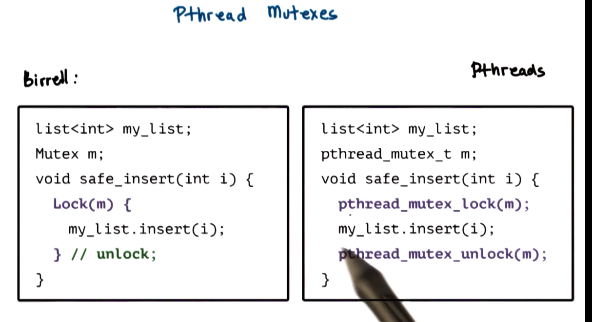

# 4. Threads Case Study: PThreads

In this lecture we will talk about **PThreads**, a standard of multithreading in Unix systems. The P in Pthreads stands for POSIX, which means **Portable Operating System Interface**. It describes the system call interface that OS's should support. 

**PThreads****describes the threading-related API that operating systems should support** in order to create and manage threads.

**PThread Creation**

Let's look at PThreads thread abstraction and the thread creation mechanism that corresponds to the mechanisms proposed by Birrell.

Let's talk in detail about pthread attributes. 

1. **attr_init **
2. **attr_destroy**
3. **pthread_attr_set/get **

The **joinable** attribute is worthy of special attention. A mechanism not discussed by Birrell is the idea of **detachable threads**. 

The default behavior of the Pthreads library is **joinable threads**, with joinable threads the parent thread creates children threads and can join them at a later time. The **parent thread should not terminate until the children threads have completed** their execution.

The alternative is **detachable threads** which don't have to rely on the parent to do clean up. 

**Compiling PThreads**

**

**

**PThread Creation: Hello World**

**

**

**

**

**

**

This is the "Hello World" of threading examples. We create 4 threads and have them say 'hullo', and then join back to the parent thread.

**PThread Creation with Argument**

**

**

**

**

**

**

What are the possible outputs to this program? We don't have control of the schedule, and there is no mutual exclusion on the variable i. 

The variable "i" is defined in main, it's globally visible. When it changes, all the other threads see the new value. This is a **race condition**.

Here is some code that fixes the problem. We create local storage for each of the arguments to the threads.

So what are the possible outputs of this updated code? We still don't necessarily have control over the scheduling of the thread.

**Pthread Mutexes**

**

**

**Mutexes** provide a mechanism to solve the mutual exclusion problem among concurrent threads. 

Birrell proposes a mutex and an operation to lock mutex. 

Unlocking is explicit in Pthreads.

Mutexes must be explicitly initialized. 

trylock allows the thread to not to block on the mutex if it is locked. It will return that it is locked, allowing it to go do other work and try again later.

**Pthread Condition Variables**

**

**

**Condition variables** are synchronization constructs that allow blocked threads to be notified that a specific condition occurs. 

**Producer and Consumer Example PThreads**

**

**

**

**

