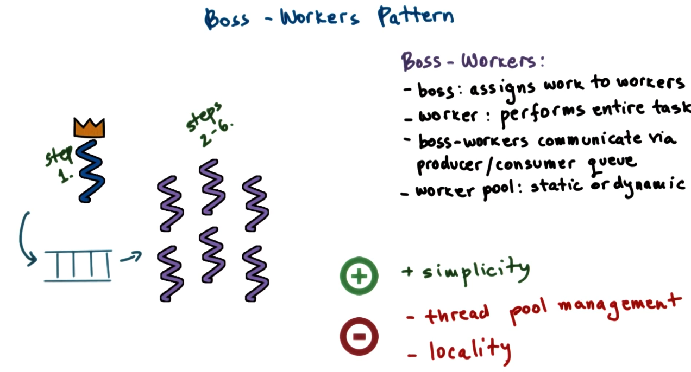
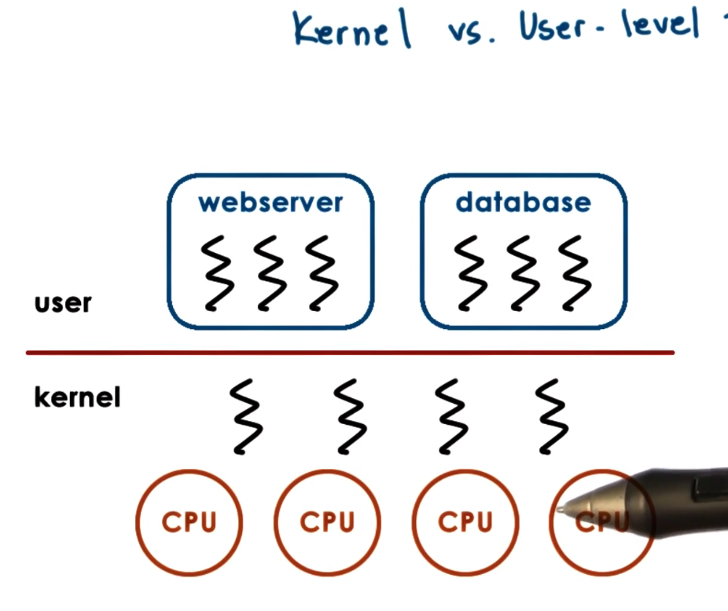
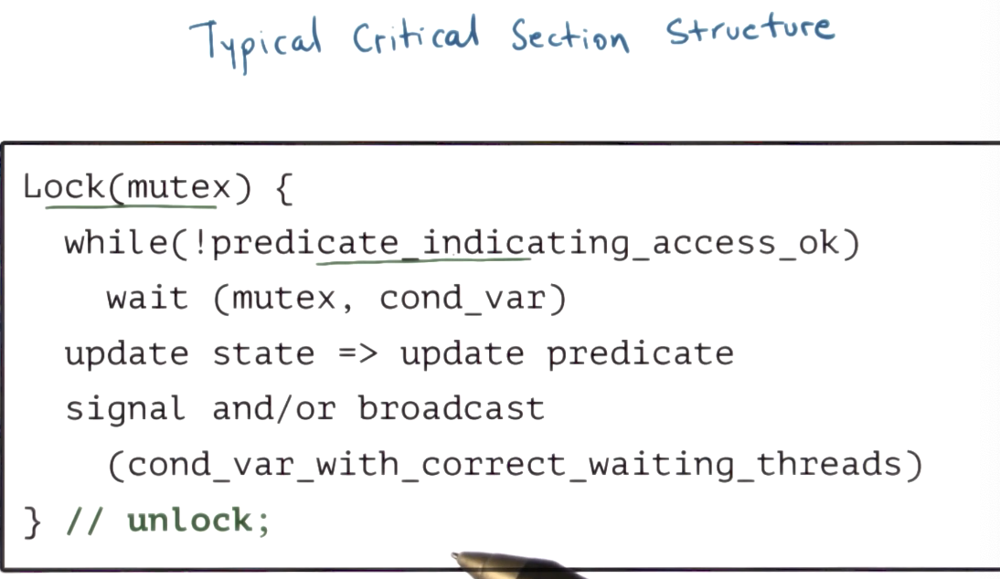

# 3. Threads and Concurrency

_How can_ we get a process to execute on multiple CPUs? We need multiple execution contexts: **Threads**!

**Visual Metaphor**

A thread is like a worker in a toy shop. 

**Process vs. Thread**

A **single-threaded process** is represented by its **address space**. The address space will contain all the** virtual to physical mappings** for the process. 

It is also represented by its **execution context**. The OS represents this information in the **process control block**. 

**Threads are part of the same virtual address space. **But, each thread has its own instructions, so it will need to manage its own set of data about execution context.

**Benefits of Multithreading**

* Parallelizing programs 
* By splitting apart the work we can have threads specialize in certain actions and we can give them preferential access to the CPU. 
* Splitting up work also means we can 
* More memory efficient, because sharing of address space and cheaper interprocess communication.

**Benefits of Multithreading: single CPU**

Are threads useful when the number of threads are greater than the number of CPUs?

As long as the time to context switch between threads is less than the idling time for the process or thread. This principle is a little different with threads because threads don't have the overhead of re-mapping the virtual-to-physical resources. Thus context switching between threads can be faster.

Multithreading can help us **hide latency**.

**Benefits of Multithreading: Apps and OS**

By multithreading the OS kernel, we allow the OS to support multiple execution contexts. This is useful when things need to run concurrently like daemons or drivers. 

**Basic Thread Mechanisms**

1. Thread data structure - identify and keep track of resource usage.
2. Mechanisms to create and manage threads.
3. Mechanisms to safely coordinate among threads running concurrently in the same address space.

What are some of the issues of concurrent execution? With concurrent processes, processes are isolated from each other and the OS will not allow one process to pollute the other. 

Threads on the other hand share the same virtual to physical mappings. This means that they can perform access on the same physical memory. This can **lead to data race problems**. 

One of the mechanisms we will use for concurrency control and coordination is **mutual exclusion**. It will only allow exclusive access to one thread at a time. 

The mechanism used is called a **mutex**. 

In addition, it is also useful to have a mechanism for threads to **wait on others to finish**. Specifically, to **wait for a condition before proceeding**. 

The mechanism used is a **condition variable**. 

**Thread Creation**

In this discussion we will discuss the APIs presented in Birrell's paper. They **don't necessarily correspond to the interfaces that are available in real threading systems**. 

The first thing we need is a **data structure that represents a thread**. We will use a thread type. 

For thread creation, Birrell proposes a **fork(proc, args)** call. This **should not be confused with the Unix System Call fork(). **The Birrell fork takes two parameters. A procedure to run and args for that procedure.

The last thing we need is a mechanism that **will return the results of an executing thread**. Birrell proposed the** join() **mechanism which will allow the parent to wait on the termination of the child thread. Join will return the results of the child's execution. 

Let's look at an example of thread creation:

In this case we have a linked-list data structure that supports a safe_insert method to add an entity to the list. The essential problem we see is that we have no guarantee about which instruction the CPU will perform first. So the child thread could run first, or the parent thread could run first, leading to different possible states. 

**Mutexes and Mutual Exclusion**

This example shows a key problem with multithreading. We need a mechanism for **mutual exclusion** among the execution of concurrent threads. 

Operating systems use a **mutex**, which is like a lock, whenever a thread needs to access state shared among threads.

When a thread locks a mutex, it has exclusive access to the resource that the mutex is guarding. Other threads will not have access. Acquisition and "acquiring" a mutex is another terminology commonly used.

As a data structure, a mutex must have data about whether it is **locked or free, who the owner is, and all the threads that are blocked on the mutex**. 

The **critical section** code is the code that needs to have mutual exclusion, everything else can be executed concurrently.

**Most common Mutex APIs have lock and unlock calls**, Birrell's unlock is down implicitly.

Let's return to the safe insert example from above and look at how it achieves safety.

**

**

**There is no guarantee on which thread will acquire the mutex after it is freed**. That's what the quiz below demonstrates.

**

**

**Producer/Consumer Example**

What if the processing you need to perform with mutual exclusion needs to occur only under certain conditions?

The **consumer thread continuously waits on the lock** and goes and checks if the list is full, otherwise it will release the lock and try again later. **This is wasteful**. Is there a better way?

Birrell recognizes that this is a common pattern in multithreading environments and the construct he argues for is a **condition variable**. 

Here is some modified producer/consumer pseudocode. 

In this new code, the producers themselves signal that the list is full. When a consumer sees it must wait, it must specify the condition variable it is waiting on. 

**Condition Variable API**

Note, that these are the APIs proposed by Birrell, not exactly what you will experience in development. 

* **wait(mutex, cond)**
* **signal(cond)**
* **broadcast(cond)**

When we have multiple consumer threads, **there is no guarantee to which thread the access of the mutex will be granted**. The while is used to support when multiple consumer threads are vying for the resource. 

**Reader/Writer Problem**

Mutexes and condition variables can be combined in multithreading applications. One common pattern is the **reader/writer pattern**. Some threads want to perform read operations on shared sate, and some threads want to write to the shared state.

The reader/writer problem is as follows: At any point in time, 0 or more readers can access the shared state to read from it, but only 0 or 1 writers can access the shared state to write to it. 

The naive solution is to lock the shared state. The problem with this solution is that only one thread can access the shared state at a time. This doesn't allow multiple readers. 

We can **use conditional expressions** to describe the proper semantics of this situation.

**All problems in computer science can be solved with one level of indirection.** We can provide a resource counter variable as a proxy for this situation.

Let's look at some code. You should notice that **actual access to the file is not controlled**. We use the resource_counter variable to make sure that the access is controlled through assertions on this variable.

Scenario: We have a writer that is actually writing and we have another writer that is waiting on the write_phase variable and multiple readers that are waiting on the read_phase variable. 

When the writer completes it exits the critical section (the write code), and it moves to the code on the bottom right. 

1. It resets the resource_counter variable.
2. Broadcast the read_phase
3. Signal the write_phase

We signal because only one thread at a time can proceed with the write operation. We broadcast to the read_phase because multiple threads can read.

What happens?!

Well, depending on which thread is serviced first (depends on the scheduler), all of the waiting threads will check their while condition variable. In this case, the readers awaken and increment the counter. The remaining threads will do the same.

**Critical Section Code Structure**

**

**

Remember, when a condition variable is signaled, the predicate conditional check in the while statement needs to be checked again.

**Critical Section Structure with Proxy**

**

**

**Common Pitfalls**

1. Keep track of mutex/condition variables used with a resource. When defining the variables, write a comment about which resource the synchronization variable should be used with.
2. Check that you are always and correctly using the lock. Did you forget to lock/unlock?
3. Did you use different mutexes for a single resource? That's bad! 
4. Check that you are signaling a correct condition.
5. Check that you are not using signal when you need to broadcast. With a signal only 1 thread will proceed.

**Common Pitfalls - Spurious Wake-ups**

This is kind of a tricky pitfall. If we wake up threads by signal/broadcast but they are still blocked on the mutex, they will wait for that mutex. The program will run fine, but it will be less efficient because there will be context switches to these waiting threads. You should only wake up threads when you are sure they can proceed.

The solution to this pitfall is context-specific. Look at the code below. Unlocking the mutex before broadcasting can solve the writer situation, but is not possible in the reader situation. 

**

**

**Deadlocks: an Introduction**

A **deadlock** is when two or more competing threads are waiting on each other to complete, but none of them ever do. 

Let's look at a visual explanation of what a deadlock looks like. We have two threads, T1 and T2 that both need to perform work on shared resources: A and B. 

The best solution to this problem is to **maintain lock order**. This will prevent cycles in a wait graph.

**Kernel vs. User-level Threads**

**Kernel level threads** imply that the OS is multi-threaded, they are visible to kernel-level components and are manipulated by kernel-level components like the kernel-level scheduler. 

**User level threads are often associated with kernel level threads **because the kernel is where a lot of interesting interaction with the hardware happens. 

**Multithreading Models - One-to-one model**

In the **one-to-one model**, each user-level thread is paired with a kernel-level thread. This means that the OS can see all the user-level threads. 

The downside of the approach is that for every operation, a system call has to be made and this can be expensive. We are also reliant on the kernel level management of the threads and the policies that are supported there.

**

**

**Multithreading Models - Many-to-one Model**

In the many-to-one model, all user-level threads are mapped to a single kernel-level thread. This means that there is a thread management library at the user-level that decides which user-level thread gets mapped to the kernel thread at any given point in time. 

The benefit of this approach is that it is totally portable -- all of the management is done at the user-level and it doesn't depend on the kernel level support for policies. Also, there aren't as many (or even no) system-calls around thread management.  

The problem with this approach is that the OS has no insight into the applications. It doesn't even know the process is multi-threaded. The real danger is that the kernel can block the thread on say an I/O operation, (not knowing it is part of a multi-threaded environment). 

**Multithreading Models - Many-to-Many model**

In the many-to-many model, some user-level threads are associated with one kernel level process, others have many to one mapping. 

This is a best of both worlds approach because the operating system has visibility into the applications, but overhead can still be eliminated by user-level thread management libraries. 

The problem with this approach is that it requires coordination between the kernel level thread management and the user-level thread management. 

**Scope of Multithreading**

There are different levels in which multithreading is supported, in the entire system or within a process. Each level affects the scope of the thread-management system. 

At the **kernel-level, we have system-wide thread management **that is supported by the Operating System thread managers. This means that the OS looks at the entire platform to make decisions about how to allocate resources.

At the** user-level, a user-level thread library that is linked to a process** manages all of the threads within that single process only. The management scope is thus much more constrained. The kernel doesn't know about all the threads because it only sees a single process and thus won't balance need as well.

**Multithreading Patterns - Boss-Workers pattern**

A popular pattern that consists of one boss thread and some number of worker threads. The **boss thread is in charge of assigning work to workers and the workers are responsible for carrying out the entire task**. 

The throughput of the system is limited by the boss's performance. 

There are a couple of strategies for this pattern. The boss can keep track of who is free and hand off work to those workers. The benefits of this approach is that the workers don't have to synchronize. The downside is that the boss has to micromanage everyone.

Another strategy is to maintain a queue between the boss and the workers. The boss places jobs in the queue and the workers grab jobs when they are free. The upsides of this approach is that the boss doesn't have to know about what each worker is doing. The downside is that now the workers and the boss have to synchronize their access of the queue. This has a better-throughput than the previous strategy.

**How many workers should we have?**

The throughput of the boss/worker system depends on how many workers are servicing the queue. The more workers there are, the more work that can be pulled from the queue. However, more workers means more system overhead (maintaining and managing more threads). 

A common model is to create a dynamic pool of workers that responds to queue load. 

One downside of this approach is locality. If a worker just completed a task, it is likely that is will be more efficient in doing a similar task because it will have cached stuff it will need. However, it is not very likely that it will be given similar work because the boss doesn't maintain this kind of information.

An alternative strategy that helps to solve this problem is to allow workers to specialize in certain tasks. This means the boss needs to know who to give work to. This achieves locality. The main challenge in this variant is the load balancing. 

**Multithreading patterns - Pipeline Pattern**

In a pipeline approach, the **work is divided into subtasks and the threads are assigned one subtask** in the system. 

Many tasks can be concurrently in the system.

The throughput of the system is dependent upon the longest-running stage in the pipeline. The way to deal with this is to manage a thread pool around the longest-running stage.

The best way to pass work between different stages is to use **shared-buffer communication between stages**.

**Multithreading patterns - Layered Pattern**

The layered pattern involves breaking up tasks into groups of related subtasks. Each thread specializes in a subtask and any thread within that specialization may service a subtask. End-to-end tasks must pass through all of the layers. 

